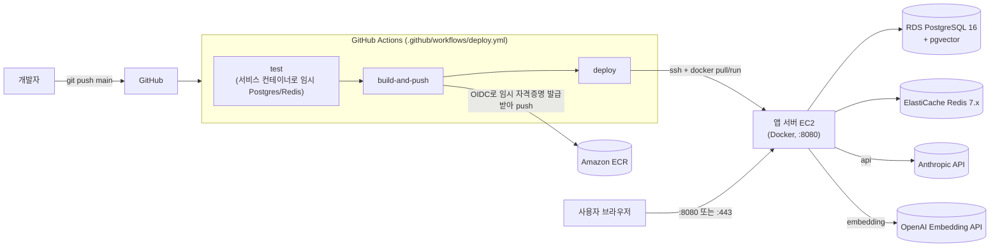

# 배포 프로세스 (AWS + Docker + GitHub Actions)

이 문서는 `schedule-manager`를 AWS 위에 Docker 컨테이너로 띄우고, GitHub Actions로 빌드/테스트/배포를
자동화하는 절차를 설명합니다. 1인 포트폴리오 프로젝트 규모를 기준으로, 비용과 구성 복잡도를
최소화하는 방향(앱 서버 EC2 단일 인스턴스 + RDS/ElastiCache 관리형 서비스 + GitHub 호스팅 러너)으로
설계했습니다.

## 목차

1. [아키텍처](#아키텍처)
2. [사전 준비물](#사전-준비물)
3. [AWS 인프라 만들기](#aws-인프라-만들기)
4. [DB 스키마 준비](#db-스키마-준비)
5. [애플리케이션 컨테이너화](#애플리케이션-컨테이너화)
6. [GitHub Actions용 IAM 역할](#github-actions용-iam-역할)
7. [GitHub Actions 워크플로 구성](#github-actions-워크플로-구성)
8. [운영 비밀값 준비](#운영-비밀값-준비)
9. [첫 배포 실행 및 검증](#첫-배포-실행-및-검증)
10. [모니터링 연계](#모니터링-연계)
11. [롤백 & 트러블슈팅](#롤백--트러블슈팅)
12. [알려진 한계 및 다음 단계](#알려진-한계-및-다음-단계)

---

## 아키텍처



Jenkins 같은 별도 CI 서버가 없습니다 — GitHub이 러너를 그때그때 띄워주므로 Jenkins EC2 자체가
필요 없고, 그만큼 인프라가 단순합니다. 대신 AWS 인증은 장기 액세스 키를 GitHub Secrets에 저장하는
대신 **GitHub OIDC**로 매 실행마다 임시 자격증명을 발급받습니다.

구성 요소 요약:

| 구성 요소 | 역할 | 비고 |
|---|---|---|
| 앱 서버 EC2 | 실제 애플리케이션 컨테이너 실행 | `t3.small` 권장, 포트 8080 |
| Amazon ECR | Docker 이미지 레지스트리 | 프라이빗 리포지토리 1개 |
| RDS PostgreSQL 16 | 메인 DB + pgvector(Mandalart/Schedule RAG) | `db.t4g.micro`로 충분 |
| ElastiCache Redis 7.x | 캐시/JWT 블랙리스트/AI rate limit | `cache.t4g.micro` |
| GitHub Actions | 빌드/테스트/이미지 푸시/배포 (GitHub 호스팅 러너) | 별도 서버 불필요 |

---

## 사전 준비물

- AWS 계정 (이 문서는 리전 `ap-northeast-2`(서울) 기준)
- AWS CLI 로컬 설치 및 자격 증명 설정 (`aws configure`) — 최초 인프라 생성 작업용
- 도메인(선택) — 없어도 EC2 퍼블릭 IP/Elastic IP로 배포까지는 가능합니다. HTTPS는
  [알려진 한계](#알려진-한계-및-다음-단계) 참고
- GitHub 저장소 관리자 권한 (Actions Secrets 등록, 워크플로 실행 확인용)
- 유효한 Anthropic API 키, OpenAI API 키(임베딩용), Google OAuth 클라이언트 ID (README.md
  "application-local.yml 설정" 절 참고 — 운영에서도 동일한 값들이 필요합니다)

---

## AWS 인프라 만들기

### 1. 보안 그룹

콘솔에서 아래 2개를 만듭니다 (기본 VPC 사용 가정).

| 보안 그룹 | 인바운드 규칙 |
|---|---|
| `sm-app-sg` | TCP 22 (0.0.0.0/0 — 아래 참고), TCP 8080 (0.0.0.0/0 — 사용자 접근용) |
| `sm-data-sg` | TCP 5432 (`sm-app-sg`에서만), TCP 6379 (`sm-app-sg`에서만) |

> **왜 22번이 0.0.0.0/0인가요?** GitHub 호스팅 러너는 고정 IP가 없어서(매 실행마다 IP 대역이 바뀜)
> 소스를 특정 IP/보안그룹으로 좁힐 수 없습니다. 대신 반드시 키 기반 인증만 허용하고
> (`PasswordAuthentication no`), 비밀번호 로그인은 꺼둡니다. 이 타협이 불편하면
> [알려진 한계](#알려진-한계-및-다음-단계)의 SSM Session Manager 전환을 참고하세요 — SSH 포트 자체를
> 열지 않아도 되는 더 안전한 대안입니다.

### 2. RDS PostgreSQL

1. RDS 콘솔 → 데이터베이스 생성 → 엔진 **PostgreSQL 16.x** (pgvector 확장을 지원하는 최신 마이너 버전)
2. 템플릿: 개발/테스트 (프리 티어 가능하면 활용)
3. 인스턴스 클래스: `db.t4g.micro`
4. 퍼블릭 액세스: **아니오**
5. VPC 보안 그룹: `sm-data-sg`
6. 초기 데이터베이스 이름: `api`
7. 생성 후 엔드포인트를 기록해둡니다 (`DB_HOST`로 사용)

### 3. ElastiCache Redis

1. ElastiCache 콘솔 → Redis → 클러스터 생성 (클러스터 모드 비활성화, 단일 노드로 충분)
2. 노드 타입: `cache.t4g.micro`
3. 보안 그룹: `sm-data-sg`
4. 생성 후 기본 엔드포인트를 기록해둡니다 (`REDIS_HOST`로 사용)

### 4. ECR 리포지토리

```bash
aws ecr create-repository \
  --repository-name schedule-manager \
  --region ap-northeast-2 \
  --image-scanning-configuration scanOnPush=true
```

출력된 `repositoryUri`를 `.github/workflows/deploy.yml`의 `ECR_REPOSITORY_URI`와
`deploy/deploy.sh` 호출부에 씁니다.

### 5. 앱 서버 EC2

1. AMI: Amazon Linux 2023, 타입 `t3.small`, 보안 그룹 `sm-app-sg`
2. IAM 역할 `sm-app-role`을 새로 만들어 연결합니다 — 정책:
   - `AmazonEC2ContainerRegistryReadOnly` (ECR pull)
   - `AmazonSSMReadOnlyAccess` (선택 — 운영 비밀값을 SSM Parameter Store로 관리하기로 하면 필요합니다.
     기본 경로인 [운영 비밀값 준비](#운영-비밀값-준비)의 수동 `.env` 작성 방식만 쓸 거면 없어도 됩니다)
3. Docker 설치:
   ```bash
   sudo dnf install -y docker
   sudo systemctl enable --now docker
   sudo usermod -aG docker ec2-user
   ```
   (그룹 반영을 위해 재접속)
4. GitHub Actions가 배포에 쓸 SSH 키 페어를 만들고, 공개키를 `~/.ssh/authorized_keys`에 등록합니다.
   개인키는 [운영 비밀값 준비](#운영-비밀값-준비)에서 GitHub Secrets에 등록합니다.
5. 비밀번호 로그인을 꺼서 22번 포트를 열어둔 리스크를 최소화합니다:
   ```bash
   sudo sed -i 's/^#\?PasswordAuthentication.*/PasswordAuthentication no/' /etc/ssh/sshd_config
   sudo systemctl restart sshd
   ```

---

## DB 스키마 준비

> **왜 마이그레이션 도구가 없나요?** 이 저장소는 아직 Flyway/Liquibase를 쓰지 않고, `ddl-auto: validate`
> 아래에서 스키마를 수동 DDL로 관리합니다 (`CLAUDE.md` 참고). 즉 "완전한 스키마"를 코드만으로 재현할
> 방법이 없고, 로컬 개발 DB 자체가 사실상 유일한 정본(source of truth)입니다. 아래 절차는 그 로컬 DB를
> 그대로 복제해 RDS에 옮기는 방식입니다. 프로젝트가 커지면 Flyway 도입을 권장합니다
> ([알려진 한계](#알려진-한계-및-다음-단계) 참고).

1. RDS에 필요한 확장을 먼저 활성화합니다 (마스터 계정으로, `api` DB에 접속해서):
   ```sql
   CREATE EXTENSION IF NOT EXISTS vector;
   CREATE EXTENSION IF NOT EXISTS "uuid-ossp";
   ```
2. 로컬의 완전히 마이그레이션된 개발 DB에서 스키마만 덤프합니다:
   ```bash
   pg_dump --schema-only --no-owner --no-privileges \
     -h localhost -U <local-db-user> -d api -f schema.sql
   ```
3. 덤프 파일을 훑어보고(테이블/제약조건/collation이 다 들어있는지) RDS로 복원합니다:
   ```bash
   psql -h <rds-endpoint> -U <rds-master-user> -d api -f schema.sql
   ```
4. 애플리케이션용 DB 계정을 별도로 만들어 최소 권한만 부여합니다 (마스터 계정을 앱이 직접 쓰지 않도록):
   ```sql
   CREATE USER schedule_manager_app WITH PASSWORD '...';
   GRANT ALL PRIVILEGES ON ALL TABLES IN SCHEMA public TO schedule_manager_app;
   GRANT ALL PRIVILEGES ON ALL SEQUENCES IN SCHEMA public TO schedule_manager_app;
   -- PgVectorStore(spring.ai.vectorstore.pgvector.initialize-schema: true)가 부팅할 때마다
   -- "CREATE TABLE IF NOT EXISTS vector_store (...)"를 시도한다 - 테이블이 이미 있어도 이 문장
   -- 자체를 실행하려면 스키마에 대한 CREATE 권한이 필요하다. 안 주면 "permission denied for
   -- schema public"으로 부팅이 실패한다
   GRANT CREATE ON SCHEMA public TO schedule_manager_app;
   ```
   이 계정 정보가 `DB_USERNAME`/`DB_PASSWORD`가 됩니다. 위 GRANT들은 반드시 3번(스키마 복원)이 끝난
   **뒤에** 실행하세요 — `GRANT ... ON ALL TABLES`는 그 시점에 존재하는 테이블에만 적용되므로, 테이블이
   생기기 전에 먼저 GRANT부터 하면 아무 효과가 없습니다.
5. 이후 스키마 변경(새 컬럼/테이블 추가)은 로컬에서 검증한 DDL을 같은 방식으로 RDS에도 수동 적용합니다
   — `ddl-auto: validate`는 운영에서도 유지합니다 (Hibernate가 스키마를 건드리지 않게).

---

## 애플리케이션 컨테이너화

`Dockerfile`은 2단계 빌드입니다:

1. **build 스테이지** (`eclipse-temurin:17-jdk-jammy`): `./gradlew bootJar -x test`로 실행 가능한 jar만
   만듭니다. 테스트를 여기서 돌리지 않는 이유는 로컬 Postgres/Redis가 필요한데 격리된 이미지 빌드
   컨테이너 안에는 그게 없기 때문입니다 — 테스트는 GitHub Actions의 별도 `test` 잡이 담당합니다.
2. **런타임 스테이지** (`eclipse-temurin:17-jre-jammy`): jar만 복사해 넣고, non-root 유저(`spring`)로
   실행합니다.

로컬에서 빌드/실행이 되는지 먼저 확인해보세요 (운영 DB에 연결은 안 되지만 이미지 자체가 만들어지는지
확인하는 용도):

```bash
docker build -t schedule-manager:local .
```

`application-prod.yml`은 `SPRING_PROFILES_ACTIVE=prod`일 때 적용되며, 모든 값을 환경변수
플레이스홀더(`${DB_HOST}` 등)로만 채워서 실제 비밀값 없이 커밋되어 있습니다. 실제 값은 배포 시
`deploy/deploy.sh`가 `--env-file`로 주입합니다 ([운영 비밀값 준비](#운영-비밀값-준비) 참고).

---

## GitHub Actions용 IAM 역할

GitHub Actions가 ECR에 이미지를 푸시하려면 AWS 자격증명이 필요한데, 액세스 키를 GitHub Secrets에
장기 저장하는 대신 **OIDC(OpenID Connect)**로 매 실행마다 임시 자격증명을 발급받습니다.

1. AWS에 GitHub의 OIDC 공급자를 등록합니다 (계정당 최초 1회):
   ```bash
   aws iam create-open-id-connect-provider \
     --url https://token.actions.githubusercontent.com \
     --client-id-list sts.amazonaws.com \
     --thumbprint-list 6938fd4d98bab03faadb97b34396831e3780aea1
   ```
   (thumbprint는 GitHub가 공개한 값입니다 — [GitHub Actions OIDC 문서](https://docs.github.com/actions/deployment/security-hardening-your-deployments/about-security-hardening-with-openid-connect)에서 최신값을 다시 확인하세요.)

2. 이 저장소(`goyois/schedule-manager`)의 `main` 브랜치에서만 assume 가능한 역할을 만듭니다.
   신뢰 정책(`trust-policy.json`):
   ```json
   {
     "Version": "2012-10-17",
     "Statement": [
       {
         "Effect": "Allow",
         "Principal": {
           "Federated": "arn:aws:iam::<ACCOUNT_ID>:oidc-provider/token.actions.githubusercontent.com"
         },
         "Action": "sts:AssumeRoleWithWebIdentity",
         "Condition": {
           "StringEquals": {
             "token.actions.githubusercontent.com:aud": "sts.amazonaws.com"
           },
           "StringLike": {
             "token.actions.githubusercontent.com:sub": "repo:goyois/schedule-manager:ref:refs/heads/main"
           }
         }
       }
     ]
   }
   ```
   ```bash
   aws iam create-role \
     --role-name gh-actions-deploy-role \
     --assume-role-policy-document file://trust-policy.json

   aws iam attach-role-policy \
     --role-name gh-actions-deploy-role \
     --policy-arn arn:aws:iam::aws:policy/AmazonEC2ContainerRegistryPowerUser
   ```
3. 생성된 역할의 ARN을 `.github/workflows/deploy.yml`의 `AWS_ROLE_ARN`에 씁니다.

배포(`deploy`) 잡 자체는 AWS 자격증명이 필요 없습니다 — SSH로 앱 서버에 접속해 스크립트를 실행할
뿐이고, 실제 `docker pull`/ECR 로그인은 앱 서버 EC2 자신의 IAM 역할(`sm-app-role`)로 이뤄집니다.

---

## GitHub Actions 워크플로 구성

`.github/workflows/deploy.yml`이 `main` 브랜치 push마다 아래 3개 잡을 순서대로 실행합니다.

| 잡 | 내용 |
|---|---|
| `test` | GitHub Actions의 서비스 컨테이너 기능으로 임시 Postgres(pgvector 이미지)/Redis를 띄우고 `./gradlew test -PciBuild` 실행 |
| `build-and-push` | OIDC로 임시 AWS 자격증명 발급 → `Dockerfile`로 이미지 빌드 → 커밋 SHA 태그 + `latest` 태그로 ECR에 푸시 |
| `deploy` | `deploy/deploy.sh`를 앱 서버로 scp한 뒤 ssh로 실행 — pull → 기존 컨테이너 교체 → 헬스체크 → 실패 시 자동 롤백 |

`-PciBuild`가 무엇을 제외하는지: `ScheduleServiceTest`의 성능 벤치마크 테스트 1개는 로컬 개발 DB에
미리 심어둔 카테고리 데이터가 있어야만 통과합니다. CI의 임시 서비스 컨테이너 DB는 매 실행 비어 있는
상태로 시작하므로 `@Tag("performance")`로 표시해 CI에서만 제외합니다 — 로컬 `./gradlew test`(플래그
없음)는 지금까지와 동일하게 이 테스트를 포함해 전부 돕니다.

설정 순서:

1. `.github/workflows/deploy.yml` 상단의 `AWS_ROLE_ARN`, `ECR_REPOSITORY_URI`, `APP_SERVER_HOST`를
   실제 값으로 바꿔 커밋합니다.
2. GitHub 저장소 → Settings → Secrets and variables → Actions → **New repository secret**:
   - `APP_SERVER_SSH_KEY` — [앱 서버 EC2](#5-앱-서버-ec2)에서 만든 SSH 개인키 전체 내용
3. `main`에 push하면 워크플로가 자동 실행됩니다. Actions 탭에서 진행 상황을 볼 수 있습니다.

---

## 운영 비밀값 준비

`deploy/app.env.example`에 필요한 환경변수 목록이 있습니다. 값이 자주 바뀌지 않는 1인 프로젝트
규모라, AWS Systems Manager Parameter Store 같은 별도 서비스를 거치지 않고 **앱 서버 EC2에
`.env` 파일을 한 번 손으로 작성**하는 방식을 씁니다 — GitHub이나 Git 어디에도 평문으로 남기지
않으면서(값은 EC2 로컬 파일로만 존재) 가장 단순한 경로입니다.

앱 서버 EC2에 SSH 접속해서:

```bash
nano /home/ec2-user/schedule-manager.env
```

`deploy/app.env.example`의 항목들을 실제 값으로 채워 저장합니다:

```bash
DB_HOST=schedule-manager-db.cctpabcwfz7d.ap-northeast-2.rds.amazonaws.com
DB_PORT=5432
DB_NAME=api
DB_USERNAME=schedule_manager_app
DB_PASSWORD=<4단계에서 만든 앱 DB 계정 비밀번호>
REDIS_HOST=<ElastiCache 기본 엔드포인트>
REDIS_PORT=6379
ANTHROPIC_API_KEY=<실제 Anthropic API 키>
ANTHROPIC_MODEL=claude-opus-4-8
OPENAI_API_KEY=<실제 OpenAI API 키>
JWT_SECRET=<256bit 이상 임의 문자열>
JWT_EXPIRATION=1800000
JWT_REFRESH_EXPIRATION=1209600000
GOOGLE_OAUTH_CLIENT_ID=<실제 구글 OAuth 클라이언트 ID>
```

```bash
chmod 600 /home/ec2-user/schedule-manager.env
```

값이 바뀌면 이 파일을 다시 수동으로 고친 뒤 `deploy/deploy.sh`를 재실행(또는 다음 GitHub Actions
배포가 자동으로 새 컨테이너를 띄울 때 반영)합니다. 값이 자주 바뀌거나 여러 서버로 늘어나면 SSM
Parameter Store/Secrets Manager로 옮기는 걸 고려하세요 ([알려진 한계](#알려진-한계-및-다음-단계) 참고).

---

## 첫 배포 실행 및 검증

1. `AWS_ROLE_ARN`/`ECR_REPOSITORY_URI`/`APP_SERVER_HOST`를 채운 `.github/workflows/deploy.yml`을
   `main`에 푸시합니다 (또는 GitHub Actions 탭에서 기존 워크플로를 **Re-run**).
2. Actions 탭에서 `test` → `build-and-push` → `deploy` 잡이 순서대로 성공하는지 확인합니다.
3. 배포가 끝나면:
   ```bash
   curl http://<app-server-ip>:8080/actuator/health
   ```
   `{"status":"UP"}`이면 정상입니다.
4. 브라우저로 `http://<app-server-ip>:8080/login`에 접속해 로그인 화면이 뜨는지 확인합니다.
5. 회원가입 → 로그인 → 일정 생성까지 골든 패스를 한 번 수동으로 확인합니다.

---

## 모니터링 연계

기존 `monitoring/docker-compose.yml`(Prometheus + Grafana)을 앱 서버 EC2(또는 별도의 작은 모니터링
EC2)에서 그대로 띄울 수 있습니다. 다만 `monitoring/prometheus/prometheus.yml`의 스크레이프 대상이
`host.docker.internal:8080`(로컬 개발용)으로 고정돼 있으므로, 운영에서는 앱 컨테이너가 떠 있는 실제
호스트를 가리키도록 바꿔야 합니다:

```yaml
scrape_configs:
  - job_name: "schedule-manager"
    metrics_path: "/actuator/prometheus"
    static_configs:
      - targets: ["localhost:8080"]  # 앱 컨테이너와 같은 호스트에서 Prometheus를 띄우는 경우
```

`/actuator/prometheus`는 `SecurityConfig`에서 인증 없이 허용되어 있으므로 별도 토큰 설정 없이
스크레이핑됩니다.

---

## 롤백 & 트러블슈팅

- **배포 직후 자동 롤백**: `deploy/deploy.sh`는 새 컨테이너가 30번(약 1분) 헬스체크에 실패하면 직전에
  떠 있던 이미지로 자동 롤백합니다.
- **수동 롤백**: 특정 커밋으로 되돌리고 싶다면 앱 서버에서:
  ```bash
  ./deploy.sh <ECR_REPOSITORY_URI> <되돌릴-이미지태그(커밋 SHA 앞 12자리)> ap-northeast-2
  ```
- **컨테이너 로그 확인**:
  ```bash
  docker logs -f schedule-manager
  ```
- **`test` 잡이 매번 느리다면**: 서비스 컨테이너는 GitHub 호스팅 러너 안에서 뜨므로 별도 튜닝 여지가
  크지 않습니다. 대부분의 시간은 이미지 빌드(`build-and-push`)가 차지하니, Docker 레이어 캐싱
  (`docker/build-push-action`의 `cache-from`/`cache-to` 등)을 도입하는 걸 고려하세요.
- **`SchemaManagementException: missing column`으로 부팅 실패**: RDS 스키마가 최신 엔티티와 어긋난
  상태입니다. [DB 스키마 준비](#db-스키마-준비)의 5번 절차(로컬에서 검증한 DDL을 RDS에도 적용)를
  놓쳤을 가능성이 큽니다.
- **`deploy` 잡이 SSH 연결에서 멈추거나 실패**: 앱 서버 보안 그룹(`sm-app-sg`)의 22번 인바운드가
  0.0.0.0/0인지, `APP_SERVER_SSH_KEY` 시크릿이 공개키와 짝이 맞는지, 앱 서버가 재기동되며 퍼블릭
  IP가 바뀌지 않았는지(Elastic IP 권장) 확인하세요.

---

## 알려진 한계 및 다음 단계

- **스키마 마이그레이션 도구 부재**: 지금은 `pg_dump`/수동 DDL로 RDS 스키마를 맞춥니다. 팀 규모가
  커지거나 배포 빈도가 늘면 Flyway 도입을 권장합니다 — 마이그레이션 이력이 코드로 남고, GitHub
  Actions 워크플로에 "마이그레이션 적용" 스텝을 추가해 이 문서의 4번 섹션 전체를 자동화할 수 있습니다.
- **SSH 대신 SSM Session Manager**: 지금은 GitHub 호스팅 러너의 유동 IP 때문에 22번 포트를
  0.0.0.0/0으로 열어둡니다. 더 안전하게 가려면 `deploy` 잡을 SSH 대신 `aws ssm send-command`(문서
  `AWS-RunShellScript`)로 바꾸는 걸 고려하세요 — 앱 서버 IAM 역할에 `AmazonSSMManagedInstanceCore`를
  붙이고 GitHub Actions에도 OIDC 역할(SSM 권한 포함)을 쓰면, `sm-app-sg`에서 22번 인바운드 규칙 자체를
  없앨 수 있습니다.
- **HTTPS 미적용**: 현재 구성은 앱 서버 EC2의 8080 포트를 그대로 노출합니다. JWT를 평문 HTTP로
  주고받는 것은 실제 사용자를 받기 전에 반드시 고쳐야 합니다. 가장 간단한 방법은 앱 서버에
  Nginx + Certbot(Let's Encrypt)을 얹어 443 → 8080으로 리버스 프록시하는 것이고, 더 정석적인
  방법은 ALB + ACM 인증서 + Route 53을 앞단에 두는 것입니다(이 경우 앱 서버를 프라이빗 서브넷으로
  옮기고 `sm-app-sg`의 8080 인바운드도 ALB 보안 그룹으로만 좁혀야 합니다).
- **단일 인스턴스, Auto Scaling 없음**: 앱 서버가 1대뿐이라 배포 중 짧은 다운타임이 있고(컨테이너
  교체 방식), 트래픽이 늘면 수직 확장(인스턴스 타입 업)부터 고려하게 됩니다. 더 크게 가려면 ECS
  Fargate + ALB로 전환하는 편이 무중단 배포/오토스케일링을 자연스럽게 얻을 수 있습니다.
- **비밀값이 EC2 로컬 파일 하나에만 존재**: 지금은 `schedule-manager.env`를 손으로 작성해 앱 서버에만
  둡니다 — 값이 바뀌면 수동으로 다시 고쳐야 하고, 서버가 여러 대로 늘어나면 매번 각 서버에 똑같이
  반영해야 합니다. 값이 자주 바뀌거나 서버가 늘어나면 SSM Parameter Store(중앙 저장 + 배포 스크립트가
  자동으로 받아오기)나, 주기적 로테이션까지 필요하면 AWS Secrets Manager로 옮기는 걸 고려하세요.
